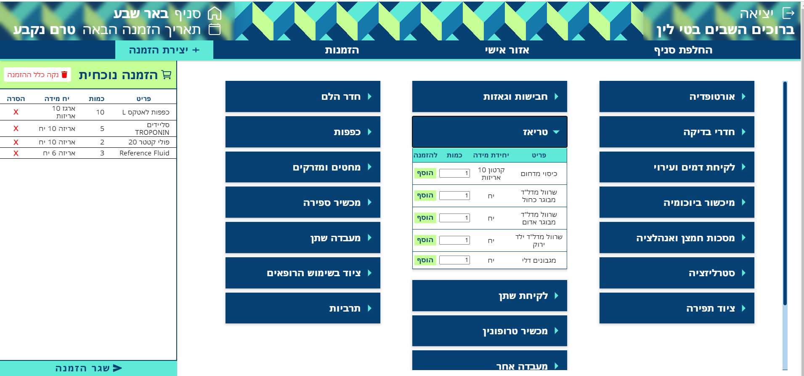
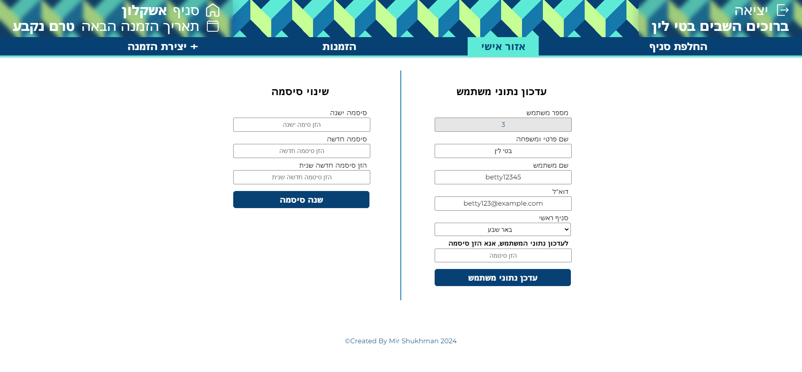
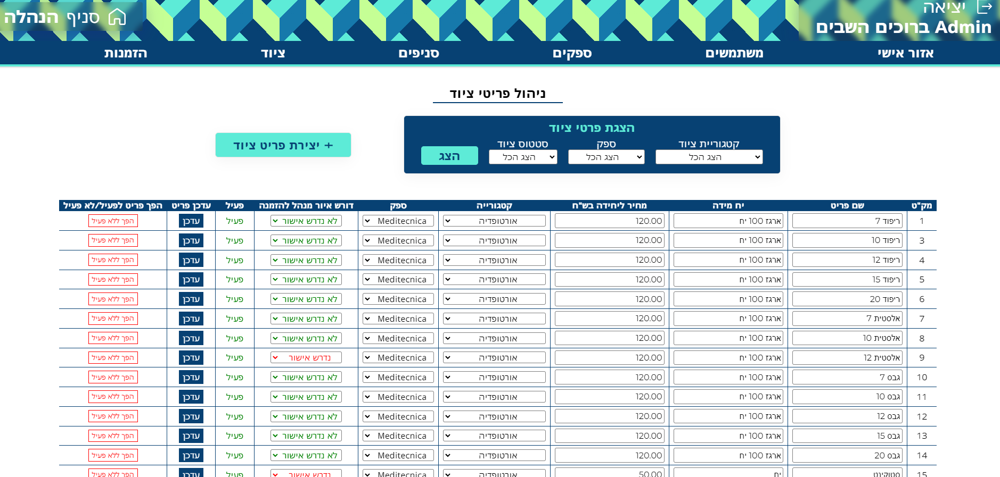
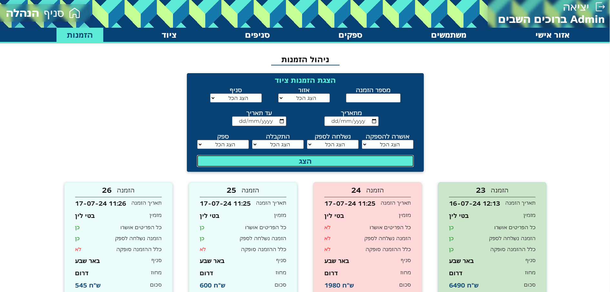
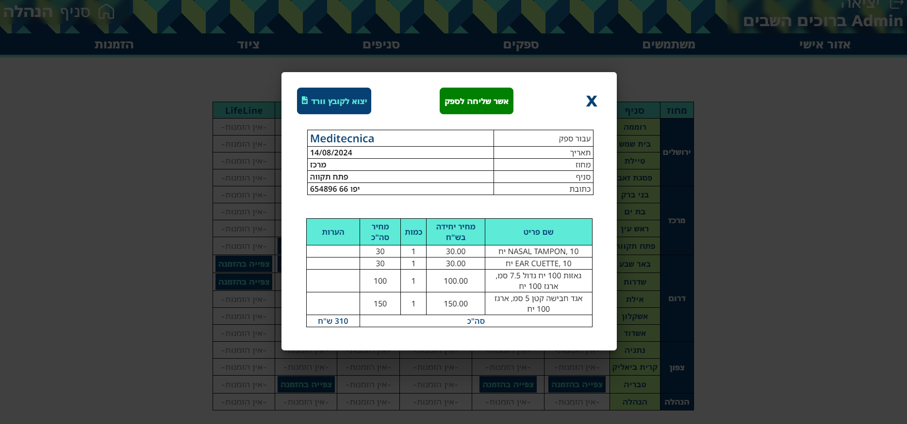

<h1>Equipment Order Management System</h1>

      System for multi-branch organizations where Equipment orders are consolidated and overseen by a Global Manager.
      The System features two types of users: Branch Manager and Global Manager.
      The Branch Managers can create, track, and confirm equipment orders, while a Global Manager oversees all branches,
      consolidates orders, and coordinates with suppliers.
      In addition, the Global Manager controls user access, manages equipment availability, and flags certain items for approval
      before external export of orders to suppliers.
      *The System is designed primarily in Hebrew. This is an early version of a later system that was developed for a multi-branch clinic.
  

  <h3>Features</h3>
  <h4>Branch Admin Interface:</h4>
  <ul>
      <li>Easy Order Creation: Allows branch admins to create orders with a categorized view of available equipment.</li>
      <li>Order Status Tracking: Track the status of orders from creation to fulfillment.</li>
      <li>Order Confirmation:  Confirm the receipt of equipment at the branch.</li>
      <li>Branch Switching: Easily switch between branches for ordering or tracking purposes.</li>
      <li>Profile Management: Update personal information and change passwords.</li>
  </ul>
  <h4>Global Admin Interface:</h4>
  <ul>
      <li>Management of Branches, Suppliers, and Equipment: View, create, and update branches, suppliers, equipment items, and categories.</li>
      <li>User Management: Create new users (external registration is not available), view users, promote them to admins, or block them from the system.</li>
      <li>Approval System: Flag certain equipment items as &apos;Manager Approval Required.&apos; Orders containing these items will need national admin approval before being sent to suppliers.</li>
      <li>Order Monitoring: View orders requiring attention (those not yet sent to suppliers or containing items requiring approval).</li>
      <li>Order Filtering: Filter orders based on various criteria.</li>
      <li>Order Dispatch: Generate Word files for orders by branch and supplier, which can be annotated and sent to suppliers. Future updates plan to send PDF orders directly via email.</li>
  </ul>
  <h4>User Authentication:</h4>
  

      The system uses Django's Token Authentication for user identification and stores passwords hashed in the database.
  

<h2>Video Demo:</h2>
<h4>Avilable on my portfolio website:</h4>
<a>https://resume-omega-pied.vercel.app/projects?project=0</a>

<h2>Screenshots:</h2>

<h3>Branch Manager Interface:</h3>

<h3>Global Manager Interface:</h3>

