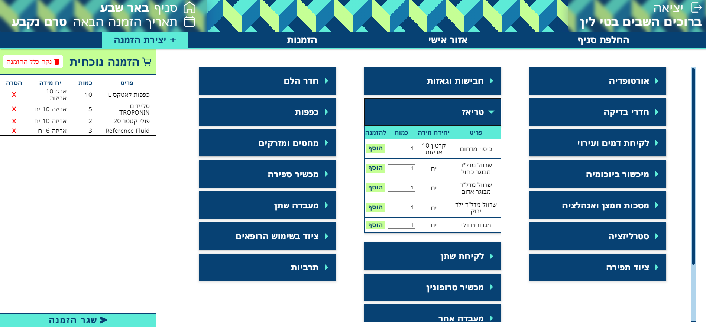

<h1>Equipment Order Management System</h1>

This is an Equipment Order Management System built using Django, React, and MySQL. The project was inspired by my desire to practice Django skills and to improve upon the equipment ordering system used at the clinic network where I previously worked. The system is designed to be a web application with a simple and user-friendly interface, primarily in Hebrew. Feedback and collabs are welcome :)

<h2>Features</h2>

<h3>Branch Admin Interface:</h3>

* <h4>Easy Order Creation:</h4> Allows branch admins to create orders with a categorized view of available equipment.

* <h4>Order Status Tracking:</h4> Track the status of orders from creation to fulfillment.

* <h4>Order Confirmation:</h4> Confirm the receipt of equipment at the branch.

* <h4>Branch Switching:</h4> Easily switch between branches for ordering or tracking purposes.

* <h4>Profile Management:</h4> Update personal information and change passwords.

<h3>Global Admin Interface:</h3>

* <h4>Management of Branches, Suppliers, and Equipment:</h4> View, create, and update branches, suppliers, equipment items, and categories.

* <h4>User Management:</h4> Create new users (external registration is not available), view users, promote them to admins, or block them from the system.

* <h4>Approval System:</h4> Flag certain equipment items as "Manager Approval Required." Orders containing these items will need national admin approval before being sent to suppliers.

* <h4>Order Monitoring:</h4> View orders requiring attention (those not yet sent to suppliers or containing items requiring approval).

* <h4>Order Filtering:</h4> Filter orders based on various criteria.

* <h4>Order Dispatch:</h4> Generate Word files for orders by branch and supplier, which can be annotated and sent to suppliers. Future updates plan to send PDF orders directly via email.
Security

<h3>User Authentication:</h3> 

The system uses Django's Token Authentication for user identification and stores passwords hashed in the database.

<h2>Technologies</h2>

Backend: Django, MySQL
Frontend: React

<h2>Future Plans</h2>

* <h4>Mobile Compatibility:</h4> Currently, the system is designed for desktop use only. Future updates will include mobile support.

* <h4>Direct PDF Dispatch:</h4> Automate the process of sending PDF order files directly to supplier email addresses.

* <h4>Usage Analytics:</h4> Implement periodic consumption average calculations for each branch, region, and national level.

* <h4>Client Requests:</h4> Any additional features as requested by clients.

<h2>Live Demo</h2>

The live demo of the system showcases a fictional multi-branch clinic inspired by the original project concept. **Please note that the demo is intended for desktop use only at this time.** For your convenience, demo user data is available on the login page.

https://mirshukhman.github.io/Equpment/

<h2>Screenshots:</h2>

<h3>Branch Manager Interface:</h3>

<h3>Global Manager Interface:</h3>

